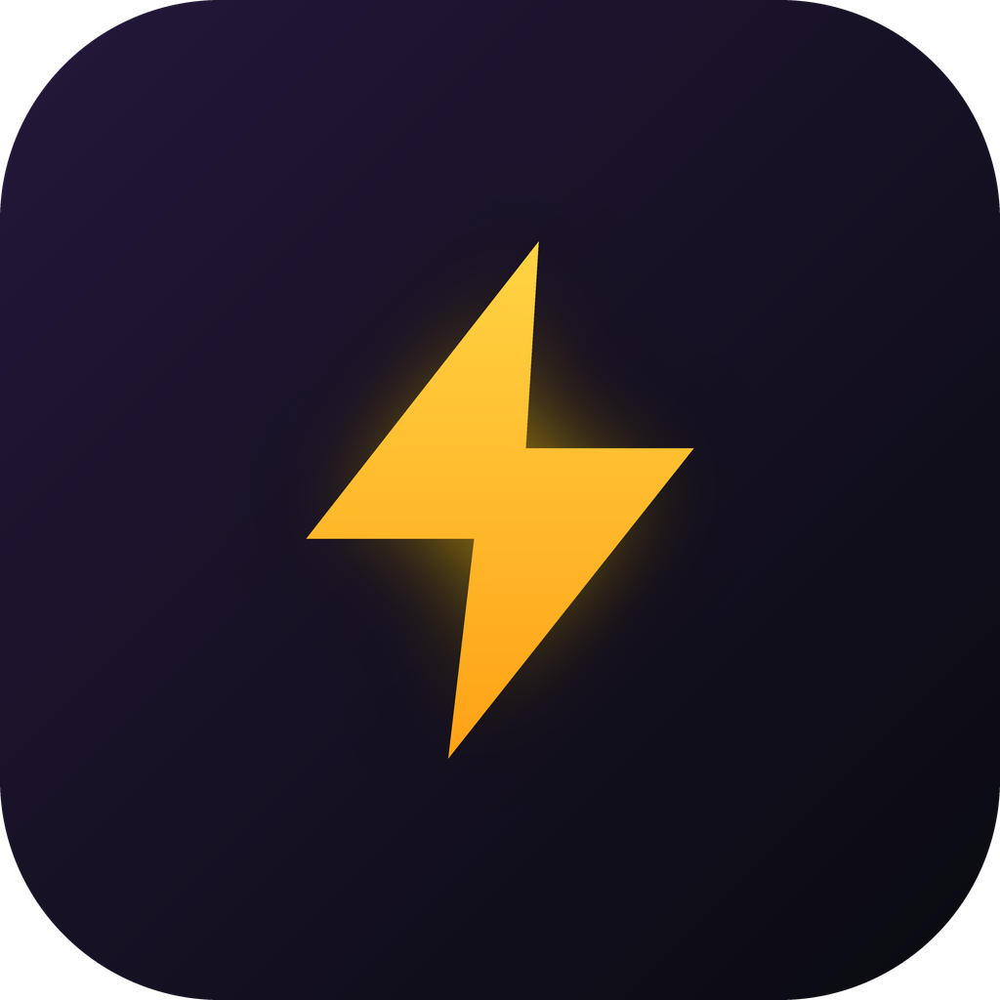
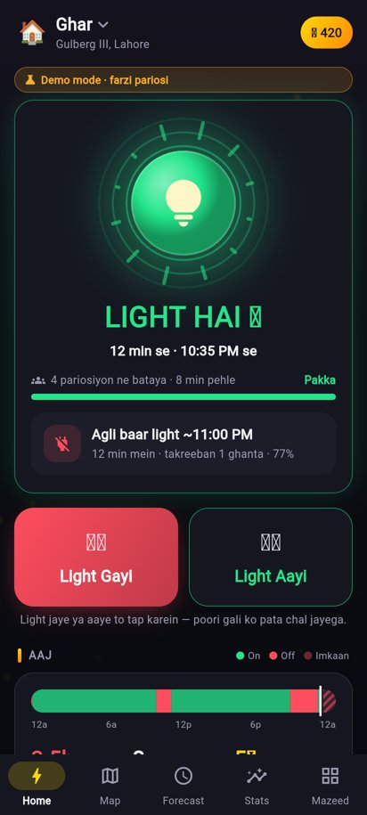
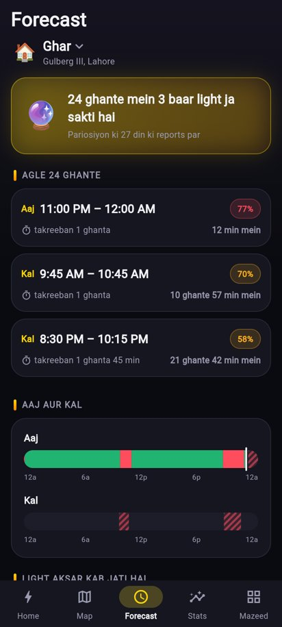
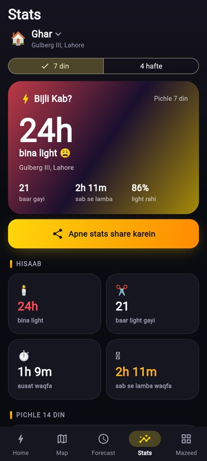
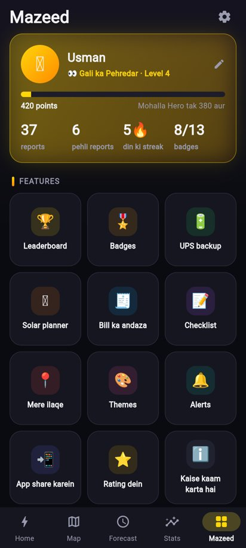
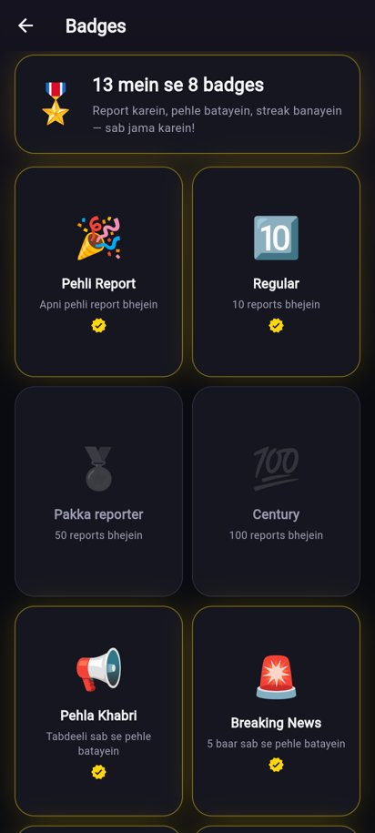
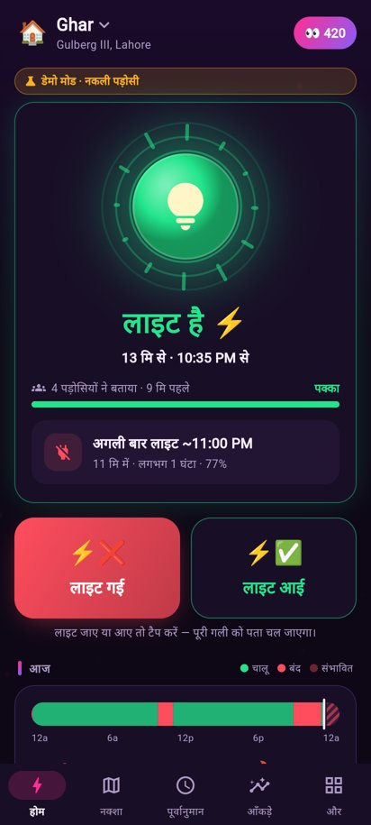
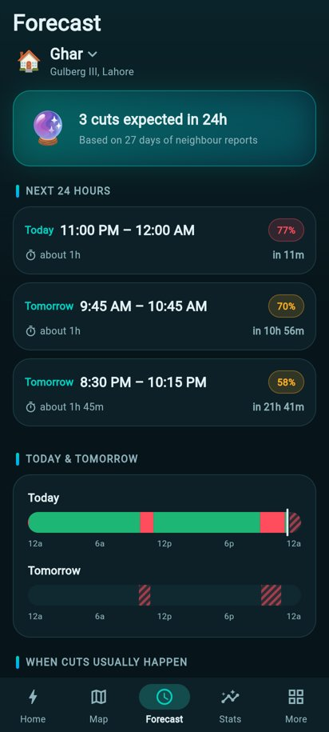

<p align="center"></p>

<h1 align="center">Bijli Kab? — Loadshedding alerts, by your neighbours</h1>

<p align="center">
Tap <b>Light Gayi</b> / <b>Light Aayi</b>. Your whole street knows instantly, and the app
learns your area's pattern to warn you <b>before</b> the next cut.
</p>

<p align="center">


</p>

<p align="center">




</p>
<p align="center">



</p>
<p align="center"><sub>Screenshots in demo mode (simulated neighbours).</sub></p>

---

## ✨ Features

| | |
|---|---|
| ⚡ **One-tap reports** | *Light Gayi* / *Light Aayi*, with an optional detail (low voltage, transformer, scheduled…). |
| 🏘️ **Neighbour voting** | Reports from the same ~1 km area are combined; a single wrong tap is out-voted. A confidence bar shows how sure the app is. |
| 🔮 **Forecast** | Learns each area's loadshedding pattern (last 4 weeks, per weekday, 15-minute slots) and predicts the next cuts and when the light comes back. |
| 🗓️ **Official schedule** | Type in the electricity company's schedule; it is merged into the forecast and alerts. |
| 🔔 **Alerts** | Warning 5–60 min before a predicted cut, "light gone / back" alerts, quiet hours, and a before-the-cut checklist reminder. |
| 🗺️ **Live map** | Nearby areas coloured green / red / grey, follow any area with one tap. |
| 📍 **Many areas** | Home, office, parents' house… switch with one tap. The ★ main area drives alerts and the widget. |
| 📊 **Stats** | Hours without light, number of cuts, longest/average cut, last 14 days, worst hours of the day, fun facts — and a shareable image card. |
| 🏆 **Points, levels & badges** | 7 levels from *Newcomer* to *Bijli Legend*, 13 badges, streaks and a leaderboard (everyone / my city). |
| 🔋 **Power tools** | UPS backup calculator (tells you if it lasts through the next cut), solar planner and bill estimator. |
| 📱 **Home-screen widget** | Your area's status, how long, and the next cut — without opening the app. |
| 🎨 **12 themes** | Neon Volt, Midnight Blue, Pure Black, Cyber Pink, Solar Sunset, Ocean Teal, Royal Purple, Emerald, Black Gold, Clean White, Sunrise Light, Mint Light. |
| 🌐 **4 languages** | Roman Urdu, اردو (right-to-left), हिन्दी and English. |

## 🧱 How it is built

```
lib/
  main.dart                 app start, Firebase or demo backend, theme/language
  theme.dart                12 palettes (BK.*)
  l10n/                     tr()/trf(), translations, time formatting
  models/models.dart        areas, reports, segments, predictions …
  services/
    status_engine.dart      reports → timeline, current status, stats, forecast (pure, unit tested)
    repository.dart         backend interface
    firebase_repository.dart  Cloud Firestore + anonymous sign-in
    demo_repository.dart    offline simulation used until Firebase is configured
    geohash.dart            areas are ~1.2 × 0.6 km geohash cells
    notification_service.dart, widget_service.dart, share_service.dart, location_service.dart
    gamification.dart       points, levels, badges
  state/app_state.dart      everything the screens show
  screens/ · widgets/       UI
android/…/BijliWidgetProvider.kt   home-screen widget
firebase/                   Firestore rules (+ tests), indexes, optional push function
store/                      Play Store listing, forms, privacy policy, graphics
```

**No area list to maintain:** an area is the geohash cell of a location, so the app works in any
city in any country from day one.

## ▶️ Run it

```bash
flutter pub get
flutter test          # 30 tests: forecast engine + every screen in all 4 languages
flutter run
```

Without Firebase the app runs in **demo mode**: simulated neighbours with a realistic
loadshedding pattern, so every screen can be tried immediately. A yellow *Demo mode* pill on the
home screen shows this. **Do not publish in demo mode.**

## 🔥 Going live with Firebase (free Spark plan is enough)

1. Create a project at <https://console.firebase.google.com> → add an **Android app** with package
   `com.farazlabs.bijli_kab`.
2. **Authentication** → Sign-in method → enable **Anonymous**.
3. **Firestore Database** → Create database (production mode, region near your users, e.g.
   `asia-south1`).
4. Put the project's keys into `lib/firebase_options.dart` — easiest:
   ```bash
   dart pub global activate flutterfire_cli
   flutterfire configure --project=<your-project-id> --platforms=android
   ```
   (or copy *apiKey, appId, messagingSenderId, projectId* by hand from
   *Project settings → Your apps*). The app switches from demo to live automatically.
5. Deploy the security rules, the leaderboard index and the 35-day clean-up (TTL) of old reports:
   ```bash
   cd firebase
   npm install
   npx firebase login
   npx firebase use <your-project-id>
   npm run deploy:rules
   npm run test:rules    # optional: 17 rule tests in the local emulator
   ```
6. *(Optional, needs the pay-as-you-go Blaze plan)* push alerts when the app is closed:
   `cd firebase/functions && npm install && cd .. && npm run deploy:functions`.
   Without it, outage warnings still work (they are scheduled on the phone) and live changes are
   shown while the app is open.

**Security rules** allow one report per person every 2 minutes, at most 40 points per report,
append-only reports, and only your own profile — see `firebase/firestore.rules`.

### Map tiles

The map uses OpenStreetMap's public tiles, which are fine for testing and small use. Before a large
launch, switch `kTileUrl` in `lib/widgets/map_tiles.dart` to a provider with a free tier (MapTiler,
Stadia Maps, Thunderforest) and keep the attribution.

## 📦 Release to Google Play

1. Create an upload key once and keep it safe:
   ```bash
   keytool -genkey -v -keystore ~/bijli-upload.jks -keyalg RSA -keysize 2048 -validity 10000 -alias upload
   ```
2. Create `android/key.properties` (never commit it):
   ```properties
   storeFile=/home/you/bijli-upload.jks
   storePassword=…
   keyAlias=upload
   keyPassword=…
   ```
3. Build: `flutter build appbundle --release` → upload `build/app/outputs/bundle/release/app-release.aab`.
4. Fill in the store forms using `store/play_listing.md` and `store/data_safety_and_forms.md`; host
   `store/privacy_policy.html` (e.g. GitHub Pages) and use its link.

Debug builds install as **Bijli Kab Dev** (`com.farazlabs.bijli_kab.dev`) next to the real app.

---

<p align="center">Made by <b>Faraz Labs</b> · Feedback: usmanfaraz1818@gmail.com</p>
